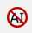
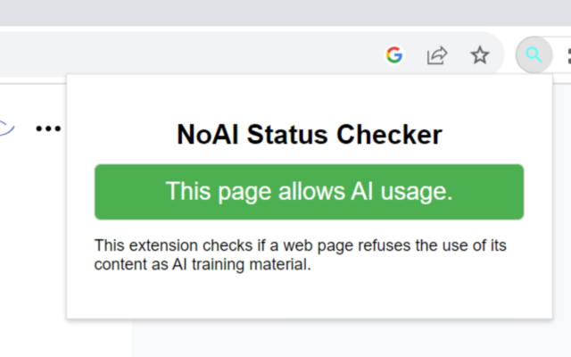
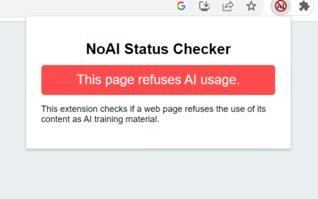

### Chrome Extension: NoAI Status Checker User Guide

---

#### 1. Introduction

The "NoAI Status Checker" is a tool designed to verify if a web page restricts its content from being used as learning material for AI models. The presence of specific meta tags within a page signifies that the content of that page is off-limits for AI training purposes.

#### 2. Installation Guide

1. Navigate to [the extension's page in the Chrome Web Store](https://chrome.google.com/webstore/detail/noai-status-checker/epnjpemolihfkpekaefjolmflciabjmb) and click on "Add to Chrome".
1. In the dialog that pops up, click "Add Extension".

#### 3. How to Use

#### 1. Automatic Detection

Upon visiting a web page, the extension automatically checks the meta tags of the page. The extension's icon will change its appearance to visually indicate whether the content on the page is available for AI training or not.

If available for AI training the extension's icon would look like this.

And if it is not available, the icon will look like this.

#### 2. Popup Verification

- Click on the extension's icon located in the Chrome toolbar.
- A popup will appear showing the AI usage status for the current page.

If available for AI training the extension's icon would look like this.

And if it is not available, the icon will look like this.

**Note**: The popup might not function as expected on certain special pages like Chrome's settings or the Web Store. In such instances, an appropriate message will be displayed within the popup.

#### 4. Important Notes

- This extension solely checks the meta tags of a web page and does not inspect other elements or the content of the page.
- Due to security reasons, there are certain pages (e.g., Chrome settings, Web Store, etc.) where the extension might not operate normally.
